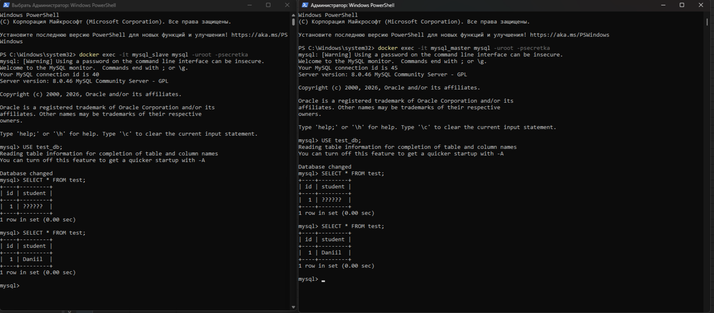
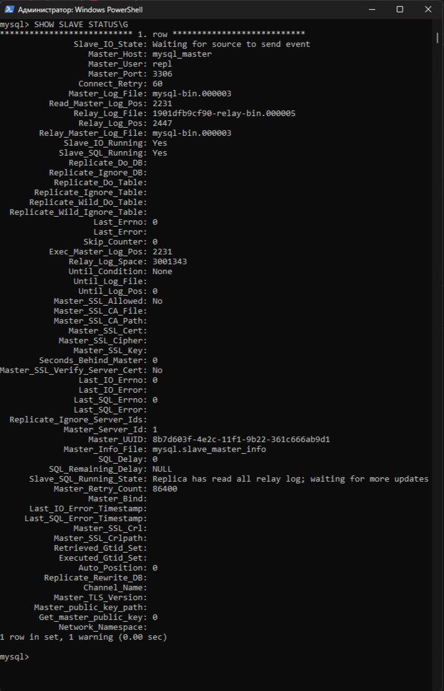
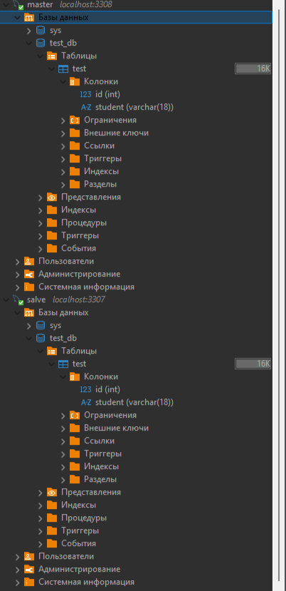

# Домашнее задание к занятию «Репликация и масштабирование. Часть 1» Гришин Даниил Алексеевич

---

## Задание 1

---

Master-slave — это однонаправленная схема: пишем только на мастер, читаем со слейва. Master-master — двунаправленная: оба сервера равноправны, можно писать на любой, и изменения реплицируются на другой. Master-master повышает отказоустойчивость, но сложнее в настройке и может вызывать конфликты.

---

## Задание 2

Файлы конфигурации в папке ./master-slave
---
